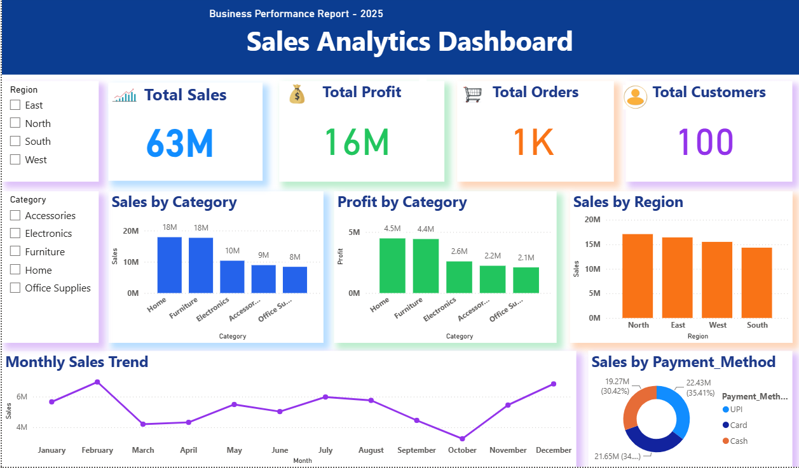

# Sales Analytics Dashboard

## Project Overview
This project is a Sales Analytics Dashboard built using Power BI and MySQL. It helps analyze sales performance, profit, orders, customers, regions, and payment methods.

## Tools Used
- Power BI
- MySQL
- SQL

## Features
- Total Sales
- Total Profit
- Total Orders
- Total Customers
- Sales by Category
- Profit by Category
- Sales by Region
- Monthly Sales Trend
- Sales by Payment Method
- Region and Category Filters

## Dashboard Preview

## Author
Ajay-S
Computer Science Student
Nandha Arts and Science College
